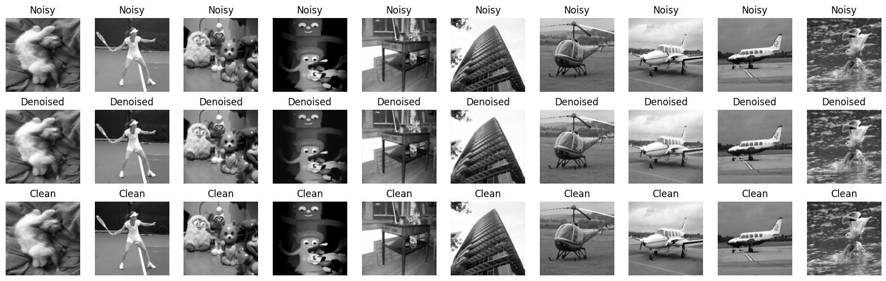
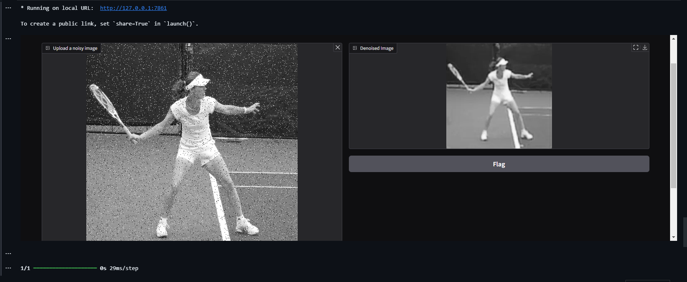

# Denoising-Images

This repository contains the implementation of a Denoising Autoencoder designed to remove salt-and-pepper noise from grayscale and colored images. The autoencoder model is trained using a deep learning approach to effectively reduce noise while preserving essential image features.

## Features

- Removes **salt-and-pepper noise** from images
- Autoencoder architecture implemented in TensorFlow/Keras
- Quantitative metrics such as **PSNR**, **SSIM**, and **MSE** for evaluating denoising performance
- Compatible with grayscale and colored images
- Preprocessing steps including image resizing and normalization
- Visual comparison between noisy and denoised images

## Table of Contents

- [Installation](#installation)
- [Usage](#usage)
- [Performance Metrics](#performance-metrics)
- [Visual Results](#visual-results)
- [Contributing](#contributing)
- [License](#license)

## Installation

1. Clone this repository:
   ```bash
   git clone https://github.com/AryanMithbawkar/Denoicing-Images.git
   cd Denoicing-Images
   ```

2. Ensure you have the necessary libraries installed:

  + TensorFlow
  + OpenCV
  + NumPy
  + Matplotlib
## Usage
1. Prepare your dataset of noisy images.
2. Use the denoise_single_image() function to denoise an individual image.
### Example Usage:
  ```python
  import cv2
  import numpy as np
  from denoising_module import denoise_single_image
  
  # Load a noisy image
  noisy_image = cv2.imread('path_to_noisy_image.png')
  
  # Denoise the image
  denoised_image = denoise_single_image(noisy_image)
  
  # Save or display the denoised image
  cv2.imwrite('denoised_image.png', denoised_image)
  ```
## Performance Metrics
The model's performance was evaluated using the following metrics:
1. PSNR (Peak Signal-to-Noise Ratio): 29.88
2. SSIM (Structural Similarity Index): 0.853
3. MSE (Mean Squared Error): 0.00147
These metrics demonstrate the effectiveness of the autoencoder in significantly reducing noise while preserving image structure.

## Visual Results
Here’s a sample visual comparison between the noisy input and the denoised output:



## Contributing
Contributions are welcome! If you’d like to contribute to this project, feel free to open issues or submit pull requests. Make sure to follow these steps:

1. Fork the repository
2. Create a new branch (git checkout -b feature-branch)
3. Commit your changes (git commit -m 'Add new feature')
4. Push to the branch (git push origin feature-branch)
5. Open a pull request
## License
This project is licensed under the MIT License. See the LICENSE file for more details.
